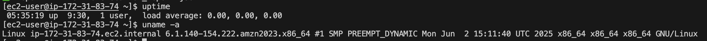
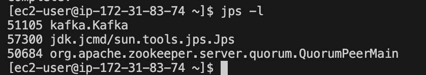
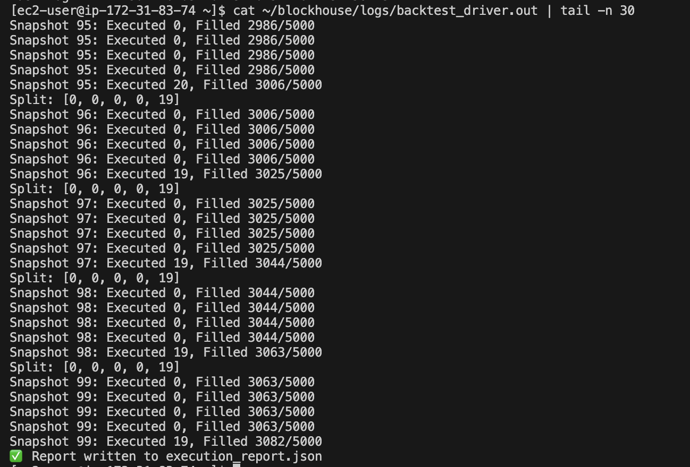
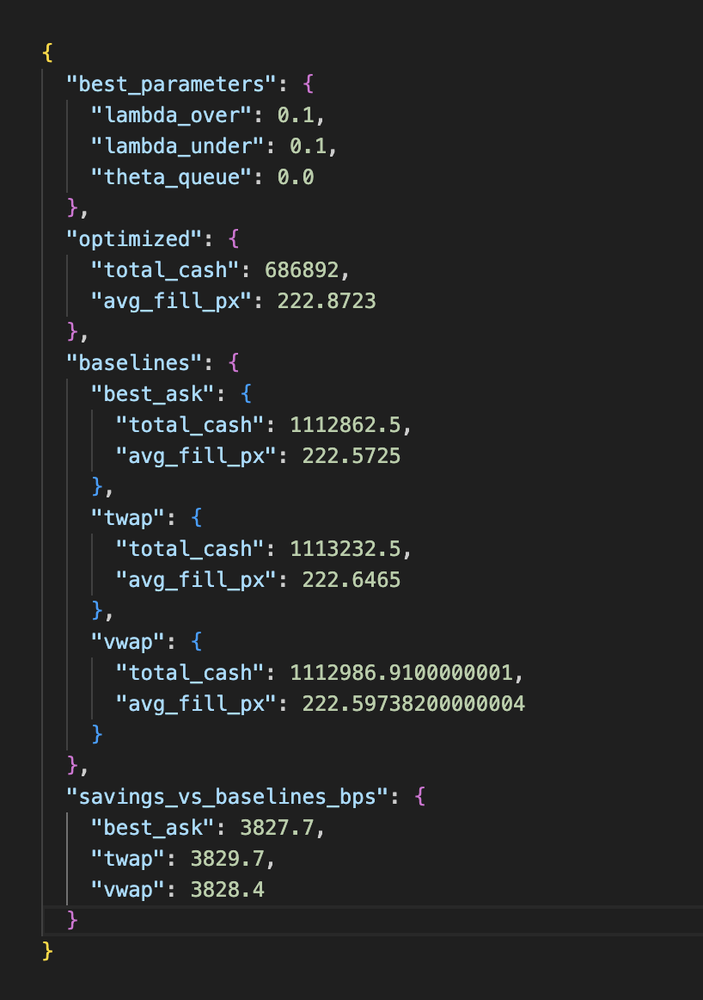

# Blockhouse Work Trial Repo

## EC2 Deployment (t2.micro with Swap)

We use a **t2.micro** instance (1 GiB RAM) to stay within AWS Free Tier, and add swap to ensure Kafka+Zookeeper can start. Below are step-by-step instructions.

---

### 1. Prerequisites

- An AWS account with permissions to launch EC2 instances.
- A local machine with:
  - SSH client (`ssh`, `scp`) and your EC2 private key file (e.g. `blockhouse-test.pem`)
  - Git installed (if cloning from a Git repository)
- The repository URL for this project: e.g. `https://github.com/yourusername/Blockhouse-Work-Trial.git`.

---

### 2. Clone the Repository Locally

On your local computer, choose or create a folder, then:

```bash
git clone https://github.com/JonathanPLev/Blockhouse-Work-Trial/tree/main
cd Blockhouse-Work-Trial
```

You should see files like:
- `setup_blockhouse.sh`
- `run_all.sh`
- Python scripts (`stream_l1_to_kafka.py`, `record_snapshots.py`, `backtest_driver.py`, etc.)
- Other config or helper files.

### 3. Create an EC2 instance
   1. Launch a t2.micro EC2 Instance
   2. In the AWS Console -> EC2 -> Instances -> Launch Instance.
   3. Choose the AMI: Amazon Linux 2023.
   4. Select Instance Type: t2.micro (1 GiB RAM). I went with t2.micro because it was part of the free access tier.
   5. Configure key pair:
   6. Create or select an existing key pair (e.g. blockhouse-key.pem).
   7. Download and keep the .pem file secure on your local machine.
   8. Configure Security Group:
   9. Allow SSH (port 22) from your IP.
   10. Launch the instance and note its Public IPv4 address (e.g. 3.123.45.67).


### 3. SSH into EC2 to verify connectivity:
     ```bash
     ssh -i <path/to/blockhouse-key.pem> ec2-user@<EC2_PUBLIC_IP>
     exit
     ```
### 4. Copy repository to EC2:
     ```bash
     scp -i <path/to/blockhouse-key.pem> -r . ec2-user@<EC2_PUBLIC_IP>:~/blockhouse/
     ```
### 5. SSH into EC2 and run setup:
     ```bash
     ssh -i <path/to/blockhouse-key.pem> ec2-user@<EC2_PUBLIC_IP>
     cd ~/blockhouse
     chmod +x setup_blockhouse.sh run_all.sh
     ./setup_blockhouse.sh
     ```
### 6. Start the full pipeline:
     ```bash
     ./run_all.sh
     ```
     - This starts Zookeeper, Kafka, creates topic `mock_l1_stream`, streams data, records snapshots, and runs backtest.
  1. After completion, inspect:
     - `execution_report.json`, `snapshots.json`
     - System info: `uname -a`, `uptime`
- **Screenshots / Results:**
  
  
  
  


